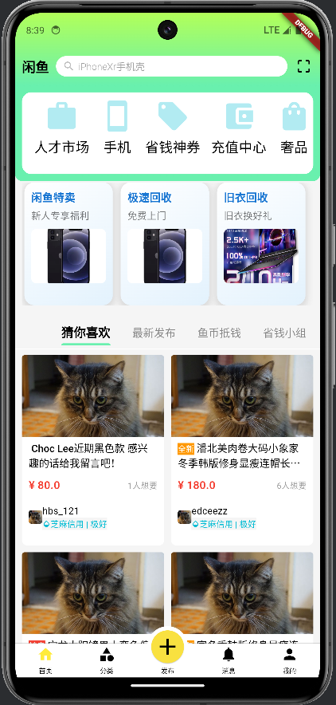
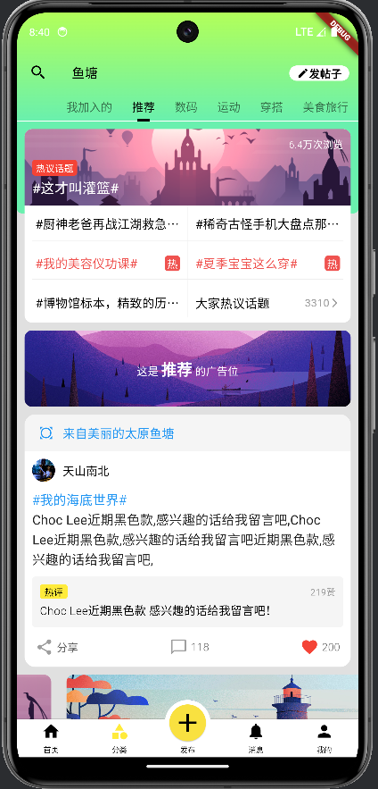
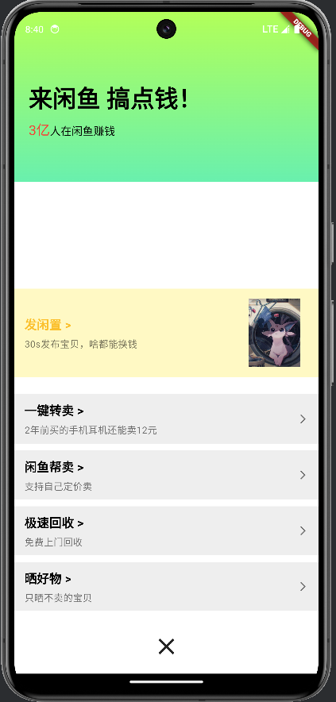
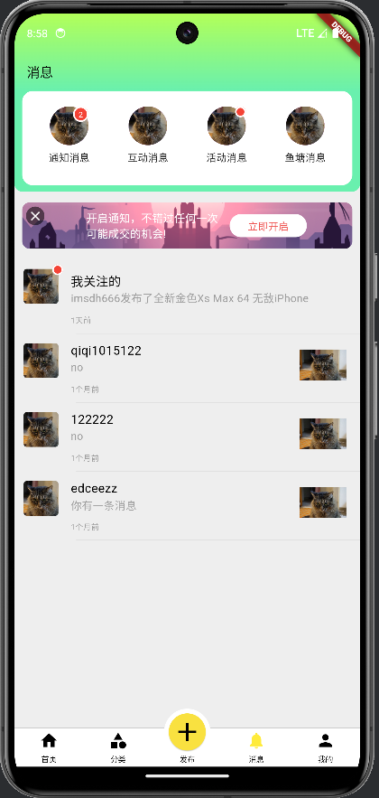
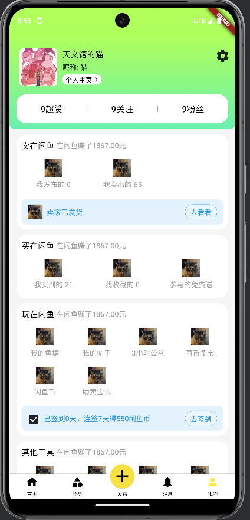

# flutter项目介绍

FishShop：基于https://github.com/fanyu/fish_shipping 原作者仿写的闲鱼app进行学习，并对源码进行了版本迭代与API更新（支持新版本Dart），以及对页面根据新版闲鱼进行改进（更新中）。

## 程序demo

                

                

## 其他
本项目打算使用本人另一个项目（实现了一些自定义组件）用于完善这个app

项目地址：https://github.com/onitor/Customize/tree/master （持续更新中）!

